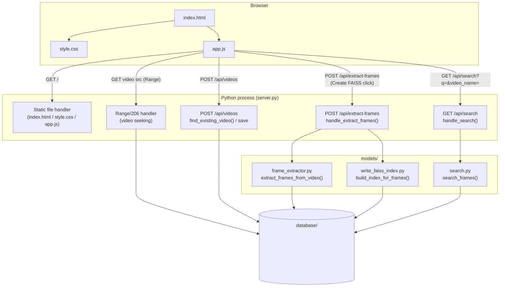
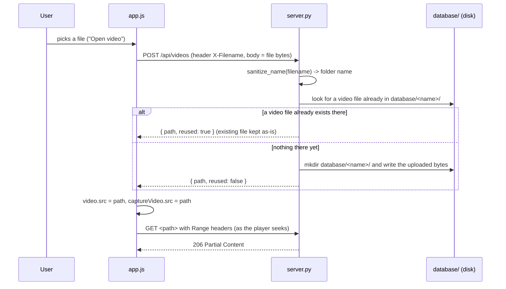
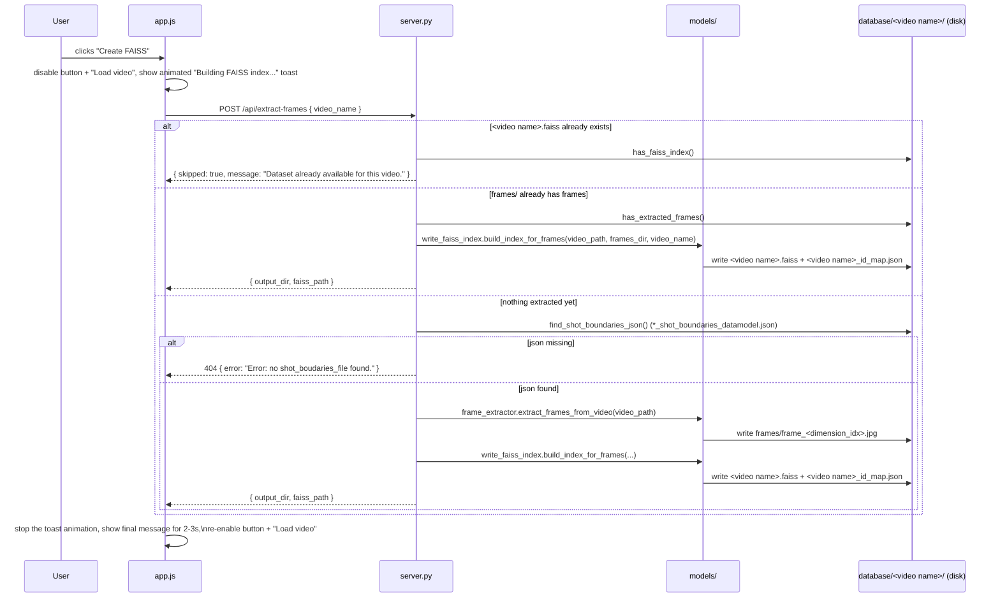
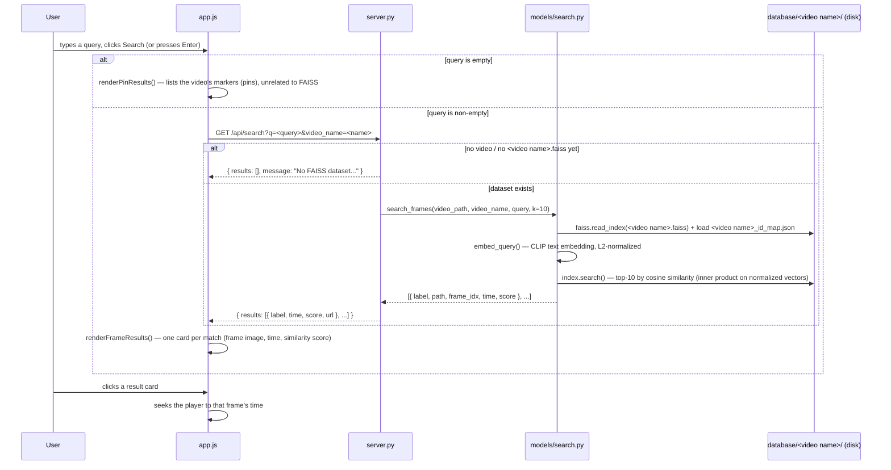

# VideoSearch GUI — Architecture

A minimal video editor / search UI: static front-end + a single-file Python
backend (`server.py`), plus a small `models/` package it calls into for
frame extraction and FAISS index building. See [requirements.txt](requirements.txt)
for the Python dependencies — the backend is no longer standard-library-only
now that it builds CLIP-based FAISS datasets.

## Files

| File | Role |
|---|---|
| [index.html](index.html) | Page structure: player, controls, timeline, search panel |
| [style.css](style.css) | Dark theme, layout (player top half, search strip below) |
| [app.js](app.js) | All front-end behavior — player, timeline/hover-preview, pins, keyboard shortcuts, search wiring, Create FAISS button |
| [server.py](server.py) | Serves the static files, stores/reuses uploaded videos under `database/`, exposes `/api/search`, `/api/videos`, `/api/extract-frames` |
| [models/frame_extractor.py](models/frame_extractor.py) | Reads a video's `*_shot_boundaries_datamodel.json` and saves one `.jpg` per shot-boundary `dimension_idx` into `frames/` next to the video |
| [models/write_faiss_index.py](models/write_faiss_index.py) | Encodes a folder of frames with a VLM (CLIP by default) and writes/loads the resulting FAISS index; also the standalone `write_faiss_index.py` CLI for building an index over an arbitrary image folder |
| [models/search.py](models/search.py) | Embeds a text query with the same VLM and searches a video's FAISS index for the `k` most similar frames (cosine similarity) |
| [models/configs.py](models/configs.py), [models/clip.py](models/clip.py), [models/siglip.py](models/siglip.py), [models/llava.py](models/llava.py), [models/vlm_wrapper.py](models/vlm_wrapper.py), [models/utils.py](models/utils.py) | VLM model/processor wrappers (CLIP, SigLIP, LLaVA) that `write_faiss_index.py` and `search.py` pick between via `model_family` |
| `requirements.txt` | pip dependencies for `server.py` and the `models/` package (torch, transformers, faiss-cpu, opencv-python-headless, ...) |
| `database/<video name>/<file>` | On-disk reference copy of each opened video (created on first open, reused after) |
| `database/<video name>/<video name>.faiss`, `..._id_map.json` | FAISS dataset built by the Create FAISS button — index + id→path lookup, saved next to the video |
| `database/<video name>/frames/` | Shot-boundary frames extracted from the video, named `frame_<dimension_idx>.jpg` |

## Component overview

## Flow: opening a video

`videoInput` change handler in [app.js](app.js) → `uploadVideo()` → `POST /api/videos` in [server.py](server.py).

`find_existing_video()` only considers files whose extension is a known
video type — this matters because a folder can also hold `.DS_Store`,
subtitles, or files a separate pipeline dropped in (`.h5`, `.json`, etc.);
those must never be picked as "the video".

## Flow: building a FAISS dataset (Create FAISS button)

`createFaissBtn` click handler in [app.js](app.js) → `createFaissIndex()` →
`POST /api/extract-frames` → `handle_extract_frames()` in [server.py](server.py),
which walks through three cases in order — each one short-circuits the rest:

Notes:

- The `.faiss` file and its `_id_map.json` are saved **next to the video and
  its shot-boundaries json** (`database/<video name>/`), not inside
  `frames/` — `frames/` only ever holds the extracted `.jpg` images.
- `build_index_for_frames()` loads CLIP (`openai/clip-vit-base-patch32` by
  default, via [models/configs.py](models/configs.py)) and encodes every
  frame; this is the slow step (tens of seconds for ~1,000 frames on CPU),
  which is why the button is disabled and the toast animates until the
  request resolves.
- **Import-order gotcha**: [models/write_faiss_index.py](models/write_faiss_index.py)
  imports `torch` before `faiss`. On macOS, the reverse order corrupts
  torch's thread-pool initialization and segfaults on the first model
  forward pass — this isn't optional style, don't reorder those imports.

## Flow: searching

`searchForm` submit handler in [app.js](app.js) → `performSearch()` →
`GET /api/search` → `handle_search()` in [server.py](server.py) →
`search.search_frames()`, which embeds the query with CLIP and does a
cosine-similarity search over the video's FAISS index:

Notes:

- `search_frames()` reuses the exact same FAISS index and CLIP model the
  Create FAISS button built — both index and query vectors are L2-normalized,
  so `IndexFlatIP`'s inner product *is* cosine similarity.
- A frame's playback time is derived from its filename
  (`frame_<dimension_idx>.jpg`) divided by the video's fps
  (`frame_extractor.get_video_fps()`, read straight from the video file via
  OpenCV) — not from the shot-boundaries json, so search still works even if
  that json is later removed.
- **Threading gotcha**: unlike `write_faiss_index.py` (which only ever calls
  `index.add()`), `search.py` calls `index.search()` — and doing that from a
  `ThreadingHTTPServer` request thread that already ran a torch forward pass
  in the same process segfaults, even with the torch-before-faiss import
  order and `faiss.omp_set_num_threads(1)`. [server.py](server.py) works
  around it by setting `OMP_NUM_THREADS=1` and `KMP_DUPLICATE_LIB_OK=TRUE`
  as environment variables *before* importing anything that pulls in
  torch/faiss — that has to happen at the very top of the file, since OpenMP
  reads them at library-load time.

## In-page state (app.js)

- `pins`: `{ id, time, label, thumb }[]` — markers placed on the timeline,
  captured as JPEG thumbnails via a hidden `<video>`/`<canvas>` pair so
  capturing a thumbnail never interrupts the main player.
- `committedTime`: the actual playhead position, kept separate from the
  live hover-preview (`isHovering`) that temporarily scrubs the paused
  player while the mouse moves over the timeline.

## Keyboard shortcuts

| Key | Action |
|---|---|
| `Space` | Play / pause |
| `A` | Add a pin at the current time |

Both are ignored while focus is on a text input (e.g. the search box).

## Known POC boundaries

- Search results aren't tied back to pins/markers — clicking a result seeks
  the player to that frame's time, but no marker is dropped on the timeline
  for it.
- Every search request reloads CLIP from scratch (`from_pretrained`, no
  caching across requests) — fine as a POC, but the first query after the
  server starts is noticeably slower until Hugging Face's local cache is warm.
- The shot-boundaries json (`*_shot_boundaries_datamodel.json`) is expected
  to already exist next to the video, produced by a separate upstream
  pipeline — `server.py`/`frame_extractor.py` only read it, they don't
  generate it.
- No authentication, no HTTPS — intended for local use only.
