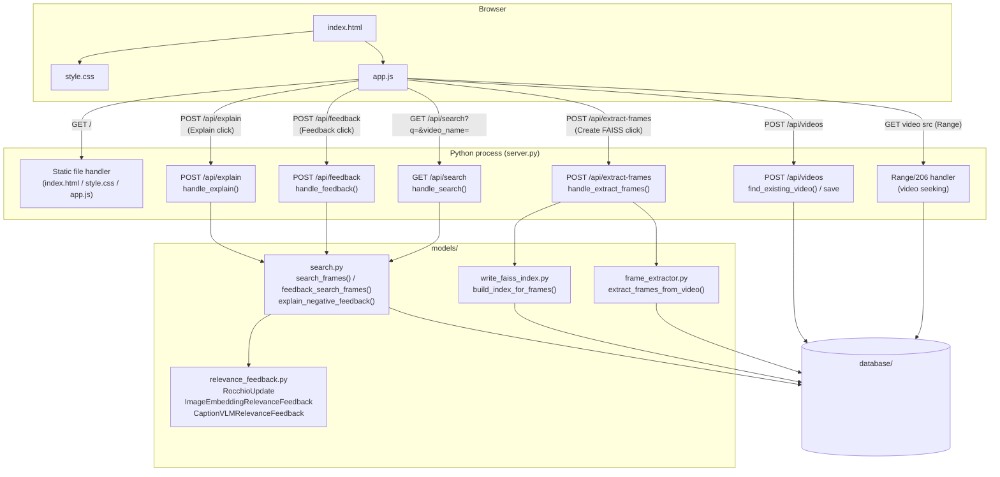
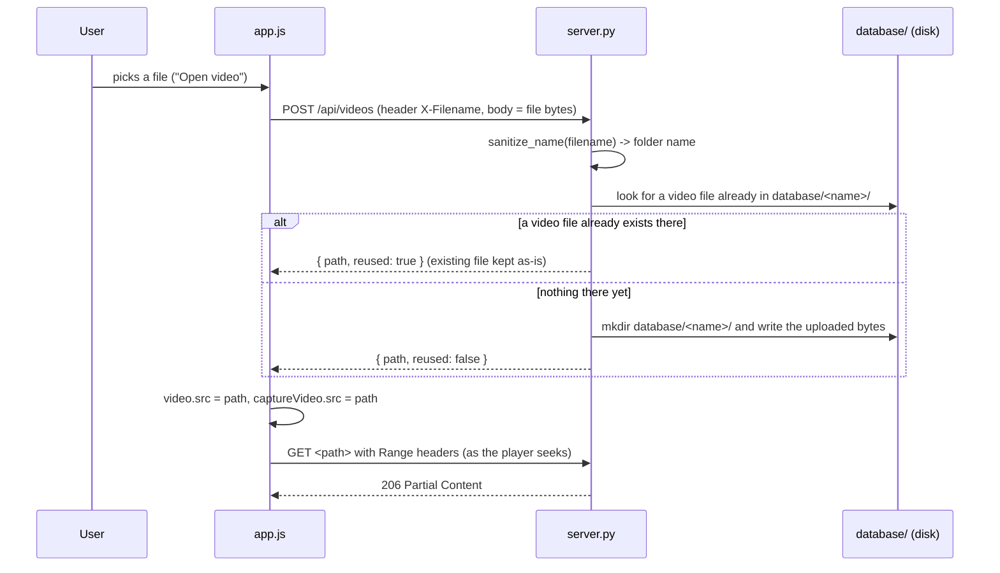
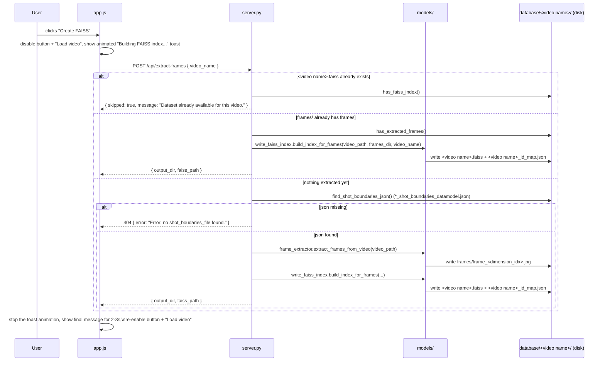
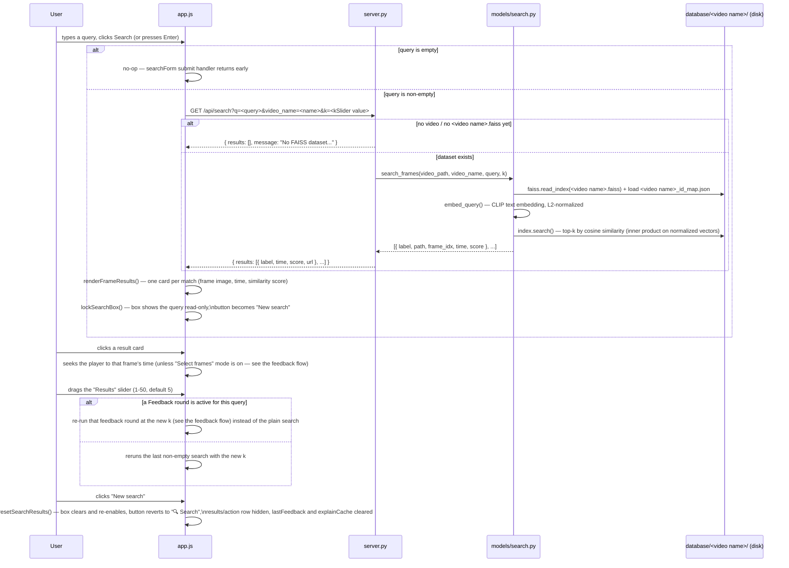
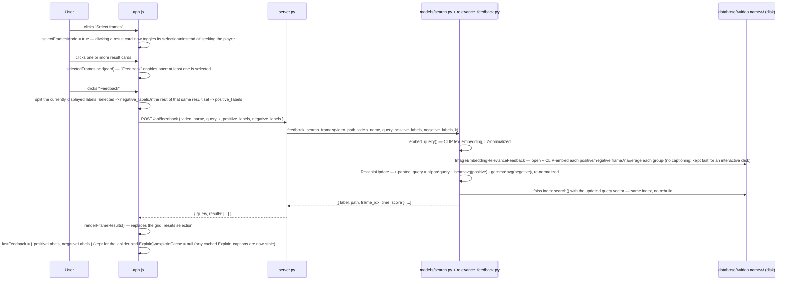
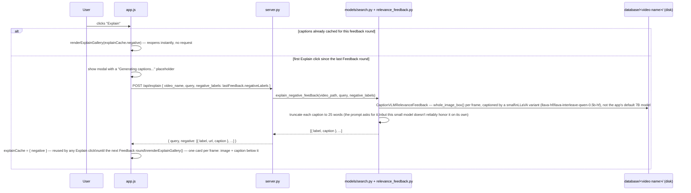

# VideoSearch GUI — Architecture

A minimal video editor / search UI: static front-end + a single-file Python
backend (`server.py`), plus a small `models/` package it calls into for
frame extraction, FAISS index building, and relevance feedback. See
[requirements.txt](requirements.txt) for the Python dependencies — the
backend is no longer standard-library-only now that it builds CLIP-based
FAISS datasets and, for Explain, runs a captioning VLM.

## Files

| File | Role |
|---|---|
| [index.html](index.html) | Page structure: player, controls, timeline, search panel, result actions, Explain modal |
| [style.css](style.css) | Dark theme, layout (player top half, search strip below), result-action buttons, modal |
| [app.js](app.js) | All front-end behavior — player, timeline/hover-preview, pins, keyboard shortcuts, search wiring (incl. the locked/"New search" box state), Create FAISS button, Select frames/Feedback/Explain wiring |
| [server.py](server.py) | Serves the static files, stores/reuses uploaded videos under `database/`, exposes `/api/search`, `/api/feedback`, `/api/explain`, `/api/videos`, `/api/extract-frames`, `/api/pins` |
| [models/frame_extractor.py](models/frame_extractor.py) | Reads a video's `*_shot_boundaries_datamodel.json` and saves one `.jpg` per shot-boundary `dimension_idx` into `frames/` next to the video |
| [models/write_faiss_index.py](models/write_faiss_index.py) | Encodes a folder of frames with a VLM (CLIP by default) and writes/loads the resulting FAISS index; also the standalone `write_faiss_index.py` CLI for building an index over an arbitrary image folder |
| [models/search.py](models/search.py) | `search_frames()` embeds a text query and searches a video's FAISS index for the `k` most similar frames (cosine similarity); `feedback_search_frames()` re-runs that search after folding relevance feedback into the query; `explain_negative_feedback()` captions a feedback round's negative frames for the Explain modal |
| [models/relevance_feedback.py](models/relevance_feedback.py) | `RocchioUpdate` (the `alpha*query + beta*positive - gamma*negative` query-update math); `ImageEmbeddingRelevanceFeedback` (averages retrieval-space image embeddings — what `feedback_search_frames` actually uses to update the query); `CaptionVLMRelevanceFeedback` (captions images with a VLM and embeds the captions — used by `explain_negative_feedback` and the checkpoint, not by the live query update); `whole_image_box()` helper for treating a whole image as one fragment; `ImageBasedVLMRelevanceFeedback` (extracts annotated image fragments — defined but not currently wired into any flow) |
| [models/configs.py](models/configs.py), [models/clip.py](models/clip.py), [models/siglip.py](models/siglip.py), [models/llava.py](models/llava.py), [models/vlm_wrapper.py](models/vlm_wrapper.py), [models/utils.py](models/utils.py) | VLM model/processor wrappers (CLIP, SigLIP, LLaVA) that `write_faiss_index.py` and `search.py` pick between via `model_family` |
| [checkpoints/vlm_checkpoint.py](checkpoints/vlm_checkpoint.py), [checkpoints/relevance_feedback_checkpoint.py](checkpoints/relevance_feedback_checkpoint.py) | Standalone, offline-image scripts proving the embedding/captioning/Rocchio pipeline actually works (cosine similarity between matching text/images; relevance feedback closing the gap between images marked Relevant vs Irrelevant) — not part of the running app |
| `requirements.txt` | pip dependencies for `server.py` and the `models/` package (torch, transformers, faiss-cpu, opencv-python-headless, ...) |
| `database/<video name>/<file>` | On-disk reference copy of each opened video (created on first open, reused after) |
| `database/<video name>/<video name>.faiss`, `..._id_map.json` | FAISS dataset built by the Create FAISS button — index + id→path lookup, saved next to the video |
| `database/<video name>/frames/` | Shot-boundary frames extracted from the video, named `frame_<dimension_idx>.jpg` |

## Component overview

## Flow: opening a video

`videoInput` change handler in [app.js](app.js) → `uploadVideo()` → `POST /api/videos` in [server.py](server.py).

`find_existing_video()` only considers files whose extension is a known
video type — this matters because a folder can also hold `.DS_Store`,
subtitles, or files a separate pipeline dropped in (`.h5`, `.json`, etc.);
those must never be picked as "the video".

## Flow: building a FAISS dataset (Create FAISS button)

`createFaissBtn` click handler in [app.js](app.js) → `createFaissIndex()` →
`POST /api/extract-frames` → `handle_extract_frames()` in [server.py](server.py),
which walks through three cases in order — each one short-circuits the rest:

Notes:

- The `.faiss` file and its `_id_map.json` are saved **next to the video and
  its shot-boundaries json** (`database/<video name>/`), not inside
  `frames/` — `frames/` only ever holds the extracted `.jpg` images.
- `build_index_for_frames()` loads CLIP (`openai/clip-vit-base-patch32` by
  default, via [models/configs.py](models/configs.py)) and encodes every
  frame; this is the slow step (tens of seconds for ~1,000 frames on CPU),
  which is why the button is disabled and the toast animates until the
  request resolves.
- **Import-order gotcha**: [models/write_faiss_index.py](models/write_faiss_index.py)
  imports `torch` before `faiss`. On macOS, the reverse order corrupts
  torch's thread-pool initialization and segfaults on the first model
  forward pass — this isn't optional style, don't reorder those imports.

## Flow: searching

`searchForm` submit handler in [app.js](app.js) → `performSearch()` →
`GET /api/search` → `handle_search()` in [server.py](server.py) →
`search.search_frames()`, which embeds the query with CLIP and does a
cosine-similarity search over the video's FAISS index:

Notes:

- The search box, its button, and the k slider are all disabled until a
  video is loaded, and the slider resets to its default (5) every time a
  new video loads (`resetSearchResults()` in [app.js](app.js)).
- Once a search succeeds, the box locks (`searchLocked = true`) to show
  exactly what was searched; the submit handler branches on that flag, so
  clicking the (now relabeled) button resets instead of searching again.
  This is also what "a completely new search never reuses feedback" means
  in practice: a fresh, unlocked search always hits plain `/api/search` and
  clears any relevance-feedback state.
- `search_frames()` reuses the exact same FAISS index and CLIP model the
  Create FAISS button built — both index and query vectors are L2-normalized,
  so `IndexFlatIP`'s inner product *is* cosine similarity.
- The loaded (model, processor) pair is cached process-wide by
  `models.configs.load_vlm_wrapper()`, keyed by
  `(model_family, model_id, device)`, and shared between `search.py` and
  `write_faiss_index.build_index_for_frames()` — so `from_pretrained()`
  (several seconds) only runs once per process, not on every search. A lock
  around the cache serializes concurrent first-time loads of the same entry
  instead of racing to build it twice; once cached, lookups are effectively
  free and don't block each other.
- A frame's playback time is derived from its filename
  (`frame_<dimension_idx>.jpg`) divided by the video's fps
  (`frame_extractor.get_video_fps()`, read straight from the video file via
  OpenCV) — not from the shot-boundaries json, so search still works even if
  that json is later removed.
- **Threading gotcha**: unlike `write_faiss_index.py` (which only ever calls
  `index.add()`), `search.py` calls `index.search()` — and doing that from a
  `ThreadingHTTPServer` request thread that already ran a torch forward pass
  in the same process segfaults, even with the torch-before-faiss import
  order and `faiss.omp_set_num_threads(1)`. [server.py](server.py) works
  around it by setting `OMP_NUM_THREADS=1` and `KMP_DUPLICATE_LIB_OK=TRUE`
  as environment variables *before* importing anything that pulls in
  torch/faiss — that has to happen at the very top of the file, since OpenMP
  reads them at library-load time.

## Flow: relevance feedback (Select frames + Feedback buttons)

`selectFramesBtn`/`feedbackBtn` click handlers in [app.js](app.js) →
`runFeedback()` → `performFeedbackSearch()` → `POST /api/feedback` →
`handle_feedback()` in [server.py](server.py) →
`search.feedback_search_frames()`:

Notes:

- Feedback is stateless per click: each round recomputes the update from
  the *original* (locked) query text plus whichever frames are currently
  marked — it doesn't compound across successive rounds.
- The search box itself never changes: it keeps showing the original
  locked query throughout, since feedback only changes which frames come
  back, not what's displayed as "the query".
- `/api/feedback` returns 400 if `query` or `negative_labels` is empty —
  the front end already guards this (`feedbackBtn` stays disabled until at
  least one frame is selected), so this is mostly a safety net for direct
  API use.

## Flow: explaining a feedback round (Explain button)

`explainBtn` click handler in [app.js](app.js) → `openExplainModal()` →
`POST /api/explain` → `handle_explain()` in [server.py](server.py) →
`search.explain_negative_feedback()`:

Notes:

- Purely explanatory: these captions are never fed back into the query —
  the actual update (previous section) is computed from raw CLIP image
  embeddings, not text.
- `explainCache` is invalidated at exactly the points `lastFeedback`
  changes: a new Feedback round, a fresh search, or "New search" — so it
  always reflects exactly one feedback round's negative frames, and
  reopening Explain without a new Feedback round costs nothing.
- The lightweight captioning model is a deliberate choice, not the
  default: loading and running `models/configs.py`'s default 7B LLaVA for
  this took multiple minutes end-to-end on this project's dev hardware
  (CPU/MPS, no CUDA) — the 0.5B interleave variant returns in roughly
  10-15 seconds including a cold model load, which is what makes an
  interactive "click Explain, see captions" flow viable at all.
- `get_device()` in [models/search.py](models/search.py) checks CUDA then
  MPS then falls back to CPU — the MPS check matters on Apple Silicon,
  where omitting it silently forces every VLM call (search, feedback, and
  especially captioning) onto the CPU path instead.

## In-page state (app.js)

- `pins`: `{ id, time, label, thumb }[]` — markers placed on the timeline,
  captured as JPEG thumbnails via a hidden `<video>`/`<canvas>` pair so
  capturing a thumbnail never interrupts the main player.
- `committedTime`: the actual playhead position, kept separate from the
  live hover-preview (`isHovering`) that temporarily scrubs the paused
  player while the mouse moves over the timeline.
- `lastSearchQuery` / `lastSearchK`: the query and k actually sent to the
  backend for the current result set — what the k slider replays on
  change, and what locks into the search box until "New search".
- `searchLocked`: whether the search box is currently showing a submitted
  query read-only (button reads "New search") versus editable (button
  reads "🔍 Search") — toggled by `lockSearchBox()` / `resetSearchResults()`.
- `selectFramesMode` / `selectedFrames`: whether clicking a result card
  toggles its selection (vs. seeking the player), and the set of currently
  selected cards — cleared by `resetSelection()` on every new result set.
- `lastFeedback`: `{ positiveLabels, negativeLabels }` from the last
  applied Feedback round, or `null` if none is active for the current
  query. Also what gates the Explain button and what the k slider replays
  instead of a plain search when set.
- `explainCache`: `{ negative }` — the last `/api/explain` response,
  reused so reopening Explain without a new Feedback round doesn't re-run
  the captioning model. Invalidated everywhere `lastFeedback` is
  reassigned.

## Keyboard shortcuts

| Key | Action |
|---|---|
| `Space` | Play / pause |
| `A` | Add a pin at the current time |

Both are ignored while focus is on a text input (e.g. the search box).

## Known POC boundaries

- Search results aren't tied back to pins/markers — clicking a result seeks
  the player to that frame's time, but no marker is dropped on the timeline
  for it.
- The shot-boundaries json (`*_shot_boundaries_datamodel.json`) is expected
  to already exist next to the video, produced by a separate upstream
  pipeline — `server.py`/`frame_extractor.py` only read it, they don't
  generate it.
- Relevance feedback doesn't compound or persist: each Feedback click
  recomputes the update from the original query text plus whatever's
  currently marked, and nothing survives a fresh search or page reload.
- Explain only covers the frames marked negative in the last Feedback
  round — there's no equivalent view for the positive side, and no
  standalone way to caption an image outside that flow.
- No authentication, no HTTPS — intended for local use only.
