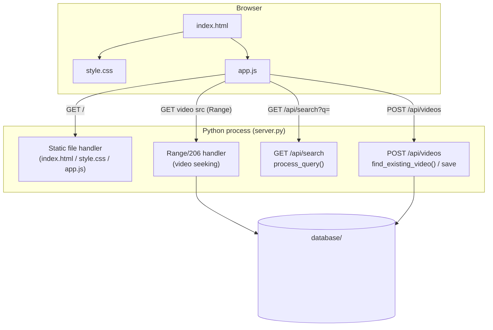
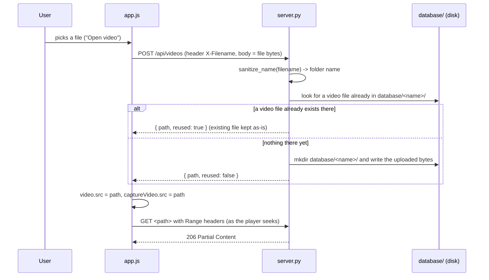
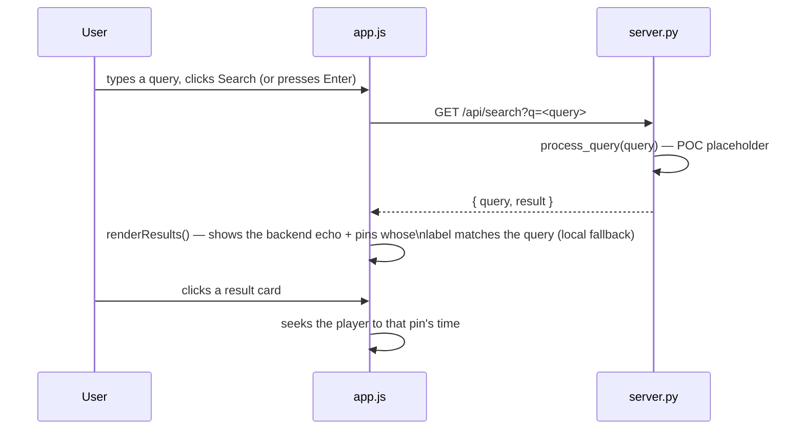

# VideoSearch GUI — Architecture

A minimal video editor / search UI: static front-end + a single-file Python
backend (standard library only, no dependencies to install).

## Files

| File | Role |
|---|---|
| [index.html](index.html) | Page structure: player, controls, timeline, search panel |
| [style.css](style.css) | Dark theme, layout (player top half, search strip below) |
| [app.js](app.js) | All front-end behavior — player, timeline/hover-preview, pins, keyboard shortcuts, search wiring |
| [server.py](server.py) | Serves the static files, stores/reuses uploaded videos under `database/`, exposes `/api/search` and `/api/videos` |
| `database/<video name>/<file>` | On-disk reference copy of each opened video (created on first open, reused after) |

## Component overview

## Flow: opening a video

`videoInput` change handler in [app.js](app.js) → `uploadVideo()` → `POST /api/videos` in [server.py](server.py).

`find_existing_video()` only considers files whose extension is a known
video type — this matters because a folder can also hold `.DS_Store`,
subtitles, or files a separate pipeline dropped in (`.h5`, `.json`, etc.);
those must never be picked as "the video".

## Flow: searching

`process_query()` in [server.py](server.py) and the local label filter in
`performSearch()` in [app.js](app.js) are both placeholders — the intended
integration point for real search logic (embeddings, a model, whatever
ends up finding frames for a query). Search results are expected to come
back as frames, each tied to a pin (`{ pinId, time, label, thumbnailUrl }`).

## In-page state (app.js)

- `pins`: `{ id, time, label, thumb }[]` — markers placed on the timeline,
  captured as JPEG thumbnails via a hidden `<video>`/`<canvas>` pair so
  capturing a thumbnail never interrupts the main player.
- `committedTime`: the actual playhead position, kept separate from the
  live hover-preview (`isHovering`) that temporarily scrubs the paused
  player while the mouse moves over the timeline.

## Keyboard shortcuts

| Key | Action |
|---|---|
| `Space` | Play / pause |
| `A` | Add a pin at the current time |

Both are ignored while focus is on a text input (e.g. the search box).

## Known POC boundaries

- `process_query()` (server.py) — swap for real search logic.
- `performSearch()` (app.js) — swap the local pin-label filter for the
  frames the real search endpoint returns.
- No authentication, no HTTPS — intended for local use only.
