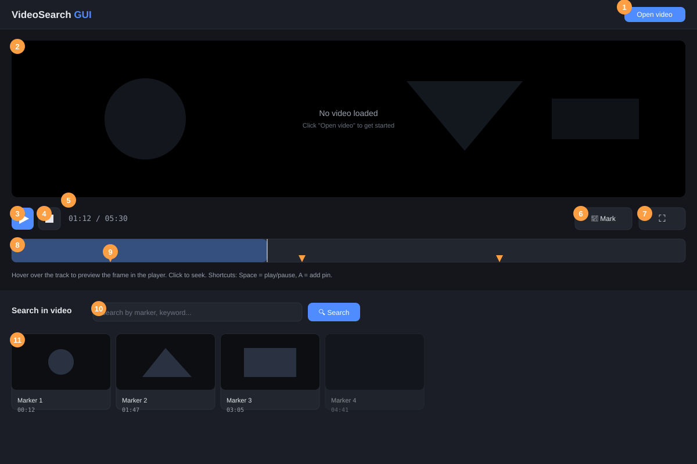

# VideoSearch GUI

A video search tool built around **VisualReF**, designed to speed up video
editing: instead of scrubbing through raw footage by hand, you search for a
moment and jump straight to the matching frames, each tied to a marker on
the timeline.

This repository currently holds the interface — player, timeline, markers,
and the search panel — with clearly marked hooks for wiring in the real
VisualReF-based search backend.

## Interface



*(diagram of the interface layout — not a live screenshot)*

| # | Element | What it does |
|---|---|---|
| 1 | **Load video** | Picks a local video file. It's uploaded to the Python backend, which stores a reference copy under `database/<video name>/` (or reuses it if that video was opened before) — see [ARCHITECTURE.md](ARCHITECTURE.md). |
| 2 | **Player** | Shows the loaded video. Fills the top half of the window (`object-fit: contain`, so the aspect ratio is preserved). |
| 3 | **Play / Pause** | Toggles playback. Also bound to the `Space` key. |
| 4 | **Stop** | Pauses and resets playback to `00:00`. |
| 5 | **Time display** | Current position / total duration. |
| 6 | **Mark** | Drops a pin at the current playback time. Also bound to the `A` key. |
| 7 | **Fullscreen** | Expands the player to fill the screen. |
| 8 | **Timeline / track** | Hovering scrubs a live preview directly in the player (frame at that point, without affecting playback); clicking seeks to that position. |
| 9 | **Pins (markers)** | One per marked moment. Click to jump to it, double-click to rename, right-click to remove. Each pin is what search results link back to. |
| 10 | **Search box** | Query field + search button. Search results come back as frames, each linked to a pin. |
| 11 | **Search results** | The frames matching the query, laid out as a horizontally scrolling strip below the player. Clicking a result seeks the player to that frame's pin. |
| 12 | **Create FAISS** | Builds a searchable FAISS dataset for the loaded video — extracting shot-boundary frames and encoding them with CLIP — and reuses whatever's already built rather than redoing it. See [ARCHITECTURE.md](ARCHITECTURE.md) for the exact steps it follows and where each file ends up. |

## Getting started

```bash
python3 -m venv .venv
source .venv/bin/activate
pip install -r requirements.txt
python3 server.py
```

Then open `http://localhost:8000`. The backend needs the packages in
[requirements.txt](requirements.txt) (torch, transformers, faiss-cpu,
opencv-python-headless, ...) — the Create FAISS button uses them to extract
frames and build a CLIP-based FAISS index per video. The first time it
runs, it downloads the CLIP model from Hugging Face unless already cached
locally.

## Architecture

File-by-file breakdown, request/response flow for opening a video and for
searching, in-page state, and the backend integration points still left as
placeholders: see [ARCHITECTURE.md](ARCHITECTURE.md).
